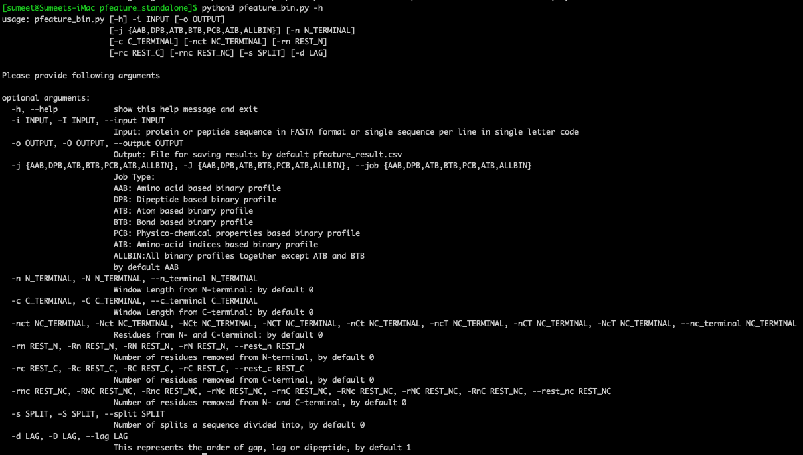

# Standalone Package of Pfeature
## Introduction
Pfeature is developed for computing wide range of protein and peptides features from their amino acid sequences, and structures. More information on Pfeature is available from its web server https://webs.iiitd.edu.in/raghava/pfeature. The standalone package of Pfeature allow users to  computes individual as well as, all possible descriptors for a protein/peptide sequence. This page provide information about standalone version of Pfeature. This standalone contains three scripts, their description is as follows:
  - `pfeature_comp.py` : To calculated composition based features
  - `pfeature_bin.py`  : To calculated binary profile based features
  - `pfeature_pssm.py` : To calculated binary profile based features
  
## Help Usage
To learn about the full usage, run the following command:
```sh
python pfeature_comp.py -h
OR
python pfeature_bin.py -h
OR
python pfeature_pssm.py -h
```
Following output will be generated on running python "pfeature_bin.py -h" command:<br>


### Parameters Description
* `Input File`: It allow users to provide input in two format:<br>
                i.  FASTA format (standard) (e.g. protein.fa)<br>
                ii.  Simple Format, file should have sequences in a single line in single letter code (eg. protein.seq).

* ``Output File``: Program will save result in CSV format, in the provided filename.
                If user do not provide output file name, it will be stored in pfeature_results.csv.
                In case user want to calculate all the features except ATB and BTB, the job name will be 'ALLBIN'. Reason to leave ATB and BTB is, the number of atoms and bonds are not equal in all amino acid residues.

Job name: It allows users to choose the type of composition, the user want to calculate, such as AAB which stands for Amino Acid based binary profile.
                In case user do not provide any job name, it will choose AAB by default.

N-terminal: It allows user to cut the specific number of residues from the N-terminal of the sequences.

C-terminal: It allows user to cut the specific number of residues from the C-terminal of the sequences.

NCT-terminal: It allows user to cut the specific number of residues from the N- and C-terminal of the sequences, and join them.

Rest_N : It allow users to drop the specific number of residues from N-terminal, and perform operations on the rest.

Rest_C : It allow users to drop the specific number of residues from C-terminal, and perform operations on the rest.

Split: It allow users to divided the sequence into number of sequences.

Lag : It defines the value for order of dipeptide, to calculate the dipeptide based binary profiles.
  
## Minimum Usage Usage
To learn about the full usage, run the following command:
```sh
python pfeature_comp.py -i protein.fa
OR
python pfeature_bin.py -i protein.fa
OR
python pfeature_pssm.py -i protein.fa
```

## Pfeature Package Files
It contantain following files, brief description of these files are given below:

* `LICENSE`                  : License information

* `README.txt`               : This file provide information about this package

* `pfeature_comp.py`         : Python program to calculate composition based features

* `pfeature_bin.py`          : Python program to calculate binary profile based features

* `pfeature_pssm.py`         : Python program to calculate pssm profile based features

* `protein.seq`              : Example file contain protein sequences in simple format

* `protein.fa`               : Example file contain protein sequences in FASTA format

* `Data `                    : This folder contains the files required to calcuate the composition and binary profile based features.

* `envfile`                  : This file contains the path information required to run the pfeature_pssm.py script.

* `Pfeature_Descriptors.pdf` : This file comprises of description of the header of output files, which is generated using the aforementioned scripts.

* `Requirement.txt`          : This file consists of commands and pre-requisite to run the aforementioned scripts.
